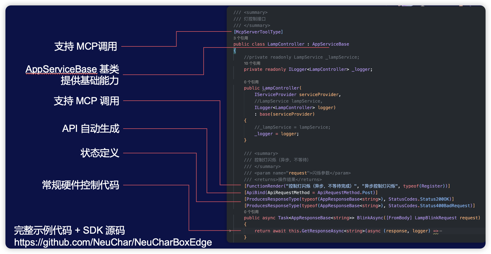
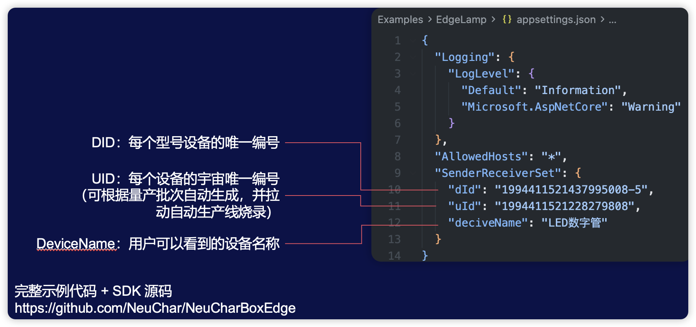

# NeuCharBox
NeuCharBox(NCB) 是一款创新的物理世界操作系统，是一款以 “设备互联 + 场景智能” 为核心的 AI 中枢设备，采用简约科技外观设计，配备支持多种有线或无线协议连接边缘模块，可兼容 VR 设备、传感器、家居电器等多形态硬件。其核心能力在于通过动态协议转换技术，实现跨品牌设备的 “数据互通 - 指令协同 - 场景联动”，并通过可视化界面呈现交互结果，成为“设备语言翻译官”和“设备协同指挥官”。NCB 可用于各类场景，例如在教育场景中：在孩子的知识学习、实验实践及综合能力培养中展现出独特价值。它的 4 大核心优势，重新定义 “智能体验”： 

## 颠覆传统电子工业制造和运行流程

### 问题一
**问题**：工业化制造流程中，所有电子产品（包括各种生产设备）零件的用途和指令已经在出厂前被固定编程和约束，任何软/硬件故障都可能导致整体功能失效，最终导致任务失败。

**NeuCharBox**：根据动态零部件（包括各类边缘设备）状态，根据设定目标自动规划零部件指令。
在产品研发阶段：可以帮助工程师快速完成产品设计和验证；
在产品运行阶段：确保所有部件按照用户端需求以最佳方案和状态柔性化地制定运行方案。

### 问题二
**问题**： 目前的工业设计流程一旦完成，边缘设备的种类就被确定或者根据自身协议严格约束（参考某米），导致扩展能力和扩展性成为瓶颈。

 **NeuCharBox**：高度的 AI 原生和模块化架构，允许设备快速接入（必须先通过平台的严格验证），通过由用户使用语音或文字设定的目标，自动分配设备用途（当然，也可以强制指定）。

### 问题三
**问题**：当前大量基于 AI 智能化硬件无法落地，一部分原因是过渡依赖 AI 实时反馈（如基于 function-calling / MCP / A2A 的响应），导致相应周期长、成本过高等问题；还有一部分原因是 AI 幻觉问题导致运行结果不稳定，无法达到工业产品要求（如众多关于汽车安全的设想）。

**NeuCharBox**：类似模型“预训练”和“后训练”过程，采用“预编程”和“后编程”机制，在运行过程中摆脱对 AI 算力依赖，成百倍地提系统升运行速度，同时基于盛派历经十余年研发的 NeuCharFramework 系统，提供了一整套多智能体工程化解决方案，动态控制成功率已接近 100%。

## 配置文件

## 关键配置信息

## NeuCharBox QQ交流群

## NeuCharBox 开发者交流群

